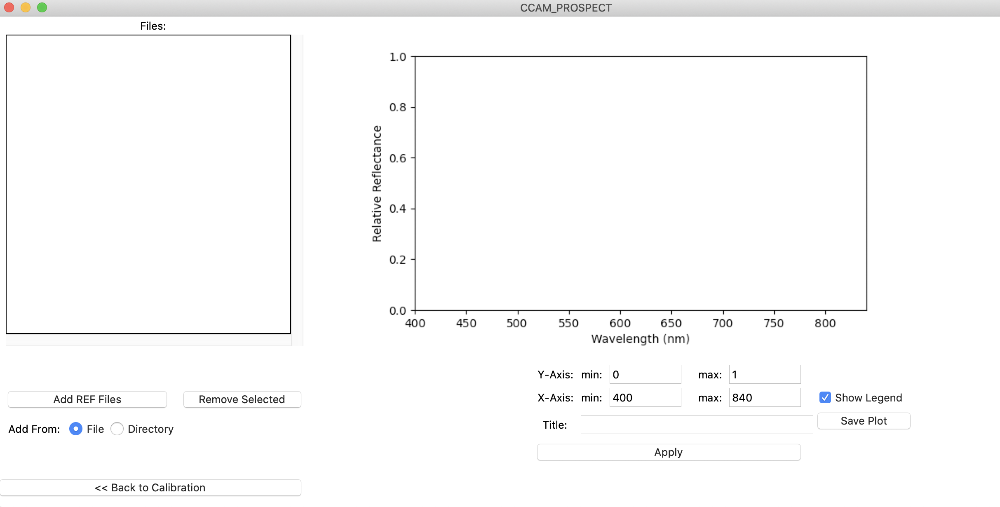

# CCAM_PROSPECT
## The ChemCam Passive Reflectance Observations Spectral Calibration Tool 

The ChemCam Passive Reflectance Observations Spectral Calibration Tool (CCAM_PROSPECT) software was developed as part of the NASA PDART contract 80NSSC19K0415 “An archive of Mars Science Laboratory ChemCam passive visible/near-infrared surface spectra”. It is written in Python and can be run on any platform that has an installation of Python 3. There is both a Graphical User Interface (GUI) option and a command line option for running the tool.

CCAM_PROSPECT calibrates raw Mars Science Laboratory (MSL) Chemistry and Camera (ChemCam) passive surface spectra (archived as “PSV” files in the Planetary Data System (PDS)) into radiance (240-905 nm) and relative reflectance (400-840 nm) spectra. Following the calibration algorithms described in the documentation accompanying the PDS-archived data set (https://pds-geosciences.wustl.edu/missions/msl/chemcam_psv_calibrated.htm), standard calibration files are used to calculate relative reflectance.  However, users may alternatively select their own calibration files. For each data file that is created, a PDS4 label is also created. Plotting options are provided to display calibrated relative reflectance spectra.  

This document outlines how to install the tool, how to run it as a GUI application or as a command line application, and addresses some common issues and troubleshooting.

## Installation
### Prerequisites:
To install CCAM_PROSPECT, users must have an installation of Python 3.6 or higher, and the capability to install packages and set up a virtual environment.
- Python 3.6 or higher(https://www.python.org/downloads/)
- pip (https://pip.pypa.io/en/latest/installing/)

### Install
NOTE: For more detailed installation instructions, see docs/UserGuide.pdf

1. clone the repository
2. create a virtual environment and activate the virtual environment (see https://docs.conda.io/projects/conda/en/latest/user-guide/tasks/manage-environments.html or https://virtualenv.pypa.io/en/latest/)
3. install the necessary modules

```
    $ pip install -r requirements.txt
```

this will install the ccam_prospect package and all required dependencies into the env “site packages”.

## Execution
Once installed, the program can be run through a GUI or command line interface.  Simply activate the virtual environment and all required libraries and modules will be ready to use.  This is the first step for either method of running the application.

#### Graphical User Interface (GUI)
```
    $ python runApp.py
```
This will open the GUI, as shown here:


The GUI is divided into five sections that are explained below. Walking through these five sections in order provides a logical flow for how to set up and run the calibration.

1.	Input:
There are 3 options for input type.  Users may select one single file to calibrate, a text file containing a list of files to calibrate, or a directory of files to calibrate.  Once the type of input is chosen using the radio buttons, users can choose the full path to the file or directory, as appropriate, by either entering it into the text box or selecting “Browse” to choose from a file browser.
Each input file must have “psv” in the name and end with “.tab” as is found in the PDS archives.
The directory option is recursive, so if users choose a directory as input, any subdirectories will also be searched for PSV files.
A list of files should be input as one single file, with each line of the file containing the full path to the file to be calibrated.

2.	Output Directory:
There are 2 options for output directory.  The default option is to use the same directory as the input directory.  This will place the calibrated files in the same directory as the raw files.  Otherwise, users can select “Use custom” and enter or browse for a custom output directory.

3. Relative Reflectance Calibration settings:
The default setting for the relative reflectance calibration algorithm is to use calibrated radiance data from the Sol 76 ChemCam calibration target #11 as the divisor for any input radiance spectrum (see PDS archive documentation for details).  If the user chooses to use another radiance file for calibration to relative reflectance, users can select “Use custom” and enter a custom radiance file.  Because the tool requires that the integration time of the input observation matches that of the reference standard, the custom calibration file should be a radiance file with the appropriate header values. The best way to ensure this is to use a file that was already calibrated to radiance using this tool, or the default Sol 76 target #11 radiance file that is already embedded in the code. If the integration time of a custom calibration file does not match that of the input file, an error dialog will be displayed and calibration of the current file will not continue. 

4. Running Options:
Users can choose to overwrite any existing radiance (RAD) files by selecting “Overwrite existing RAD” and any existing relative reflectance (REF) files by selecting “Overwrite existing REF”.

There are also options for smoothing the VIO and VIS regions of the REF data. A user can choose to smooth VIO, VIS, or both. If the "smooth VIO" option is selected, data between 241nm and 469nm will be smoothed with a 51-channel moving median filter. If "smooth VIS" is selected, data between 473 and 905nm will be smoothed.

The two buttons at the bottom are used to run the calibration.  Selecting “Calibrate to RAD” will run the radiance calibration on input PSV file(s) and output to the appropriate directory, overwriting files as designated using the radio buttons described above.

Running “Calibrate to REF” will run both the radiance calibration and the relative reflectance calibration. Input for relative reflectance calibration can be either a raw PSV file or a RAD file created with CCAM_PROSPECT. If it is a PSV file, the tool will first create a RAD file and then create a relative reflectance file from that file.

Once all desired options and configuration are set, run the program by selecting the appropriate button in the Running Options section of the GUI. Progress will be shown in the progress bar as well as output on the terminal from which you started the GUI. 

5. Plotting Options
Clicking this button will open a separate window to plot relative reflectance spectra. Plotting is discussed in the Plotting Capabilities section on page 6.

### Command Line
There is also an option to run the tool via command line.  To run the radiance calibration from the command line, users will run the same initial setup steps,
Then run 

```
python full_path/ccam-prospect-x.x.x/ccam_prospect/radianceCalibration.py [-h] [-f CCAMFILE]
[-d DIRECTORY] [-l LIST] [-o OUT_DIR] [--no-overwrite-rad]
```

 running with no arguments or with the -h flag will show a help menu that lists all argument options.

```
optional arguments:
  -h, --help      show this help message and exit
  -f CCAMFILE     CCAM psv *.tab file
  -d DIRECTORY    Directory containing .tab files
  -l LIST         File with a list of .tab files
  -o OUT_DIR      directory to store the output files
            --no-overwrite-rad  do not overwrite existing files 
```

Just as in the GUI option,  input can be a file, list of files, or directory.  Users will select only one of the -f, -d, or -l flags to designate which type of input is provided, followed by that input.  The -o flag is used for a custom output directory instead of the default option, which is to output to the same directory as input.  All files will be overwritten by default, unless the *–no-overwrite-rad argument* is used.  An example of running radiance calibration from the command line is: 

```
$ python full_path/ccam-prospect-x.x.x/ccam_prospect/radianceCalibration.py -f psvFile.tab -o /Users/me/out/ --no-overwrite-rad
```

this will run the radiance calibration on psvFile.tab and save the output to the directory */Users/me/out/*, but will not overwrite any existing files. 

The relative reflectance command line arguments are very similar.

```
python full_path/ccam-prospect-x.x.x/ccam_prospect/relativeReflectanceCalibration.py [-h] [-f CCAMFILE]
[-d DIRECTORY] [-l LIST] [-o OUT_DIR] [--no-overwrite-rad] [--no-overwrite-ref]

optional arguments:
  -h, --help          show this help message and exit
  -f CCAMFILE         CCAM psv or rad *.tab file
  -d DIRECTORY        Directory containing .tab files to calibrate
  -l LIST             File with a list of .tab files to calibrate
  -c CUSTOMFILE       custom calibration file
  -o OUT_DIR          directory to store the output files
  --no-overwrite-rad  do not overwrite existing RAD files
  --no-overwrite-ref  do not overwrite existing REF files
  --smooth-vio        apply 51-channel filter to smooth VIO region
  --smooth-vis        apply 51-channel filter to smooth VIS region
```

There are four additional optional arguments, *-c CUSTOMFILE*, *–no-overwrite-ref*, *–smooth-vio*, and *-smooth-vis*.  The custom file option is an input file to use as the denominator in the relative reflectance calibration. The smooth options will smooth data in the vio and vis regions. An example of calibrating a whole directory to relative reflectance using a custom file is below: 

```
$ python full_path/ccam-prospect-x.x.x/ccam_prospect/relativeReflectanceCalibration.py -d /Users/me/raw_files/ -c custom_rad.tab 
```

Because an output directory was not provided in this example, the output will be saved to the same directory, */Users/me/raw_files/*.  By not providing a *–no-overwrite-rad* or *–no-overwrite-ref* option, any RAD or REF files will be overwritten if they already exist.  This command will loop through all files in */Users/me/raw_files/* and its subdirectories, calibrating to both RAD and REF, and overwriting any existing files. Using just the *–no-overwrite-rad* option on its own would use the existing RAD files for the reflectance calibration and overwrite any existing REF files.

For either type of calibration, progress will be printed to the command line. 


## File Formats and PDS Archive
The output files follow a specific naming convention for archive in the PDS, as shown in the table below.

| file type | file name |
|----------|----------|
| Input File (from PDS) |  cl9_404236313psv_f0050104ccam01076p3.tab |
| Output Radiance File | cl99_404236313rad_f0050104ccam01076p3.tab |
| Output Relative Reflectance File  | cl9_404236313ref_f0050104ccam01076p3.tab |

The format for each of the files will be two-column ASCII tables where the first column is the wavelength (in nanometers) and the second column is either the radiance value (in units of W/m2/sr/um) or relative reflectance (0.0 to 1.0 for valid values). RAD files (output radiance files) will have the same 29-line header as the raw PSV files, with the table starting on line 30. The data table starts on line 1 of REF files.
A label that follows PDS4 standards will be created for each output file.  This is an XML file with information about the RAD or REF file and the source PSV file that it was derived from.

## Plotting Capabilities
CCAM_PROSPECT also has a plotting functionality, which can be used to plot relative reflectance spectra.  This capability is accessed by clicking the *“Relative Reflectance Plotting”* button on the main GUI. When selected, the GUI will switch to the plotting view. On the left side, there is initially an empty list which will hold the REF files that are shown in the plot. The *“Add”* and *“Remove”* buttons can be used to populate and edit that list.  Once files are added, they will be shown in the list on the left and plotted on the right. Files can be added individually or from a directory. Under the *“Add REF Files”* button there is a radio button option for adding from File or Directory. When *"File"* is selected, the file chooser will allow the user to add an individual REF file. When *“Directory”* is selected, the file chooser will allow the user to select a directory and will add each REF file from the chosen directory. The user can adjust the y- and x-axes along with the Title of the plot with the controls under the plotting area. Lines can be removed from the plot by choosing the file in the list and selecting *“Remove”*. The user can save the plot to a file by selecting *“Save Plot”* and choosing a location and file format. Once created (by adding lines to the plot), the legend can be moved around by clicking and dragging, and can be hidden by deselected *“Show Legend”*.


## Acknowledgements
CCAM_PROSPECT is supported by NASA PDART Contract 80NSSC19K0415.

